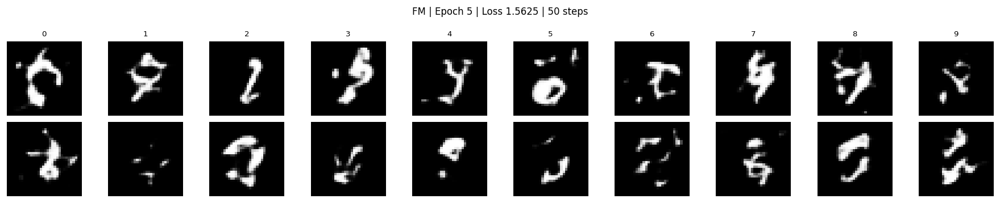
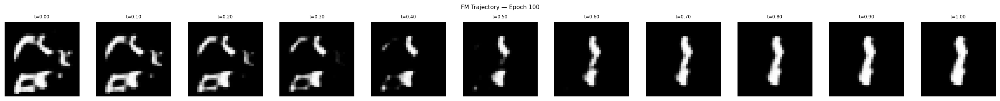
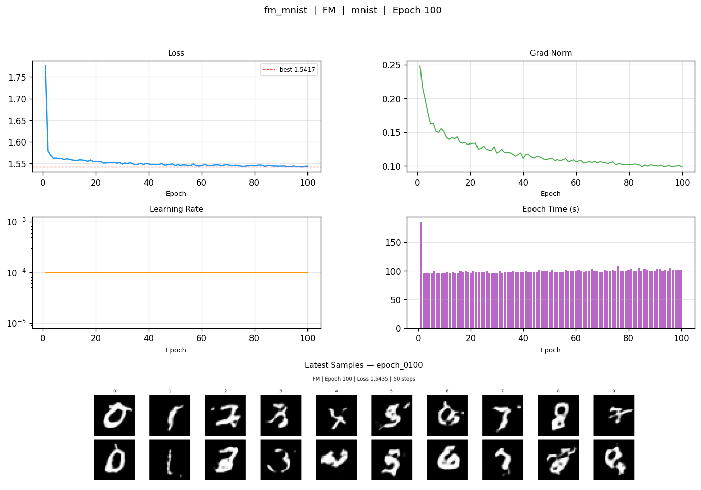
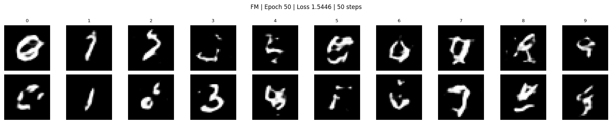
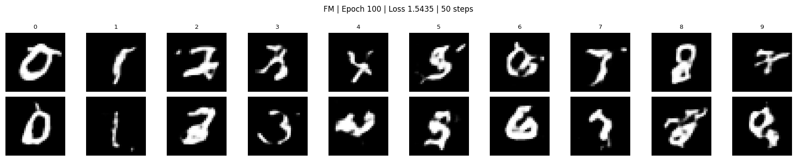

# acceleration-flow-matching

A latent diffusion framework comparing DDPM, DDIM, and Flow Matching on MNIST and CIFAR10, built on a shared ViT backbone with a spatial VAE. Trained on Google Colab (T4/V100, 12GB VRAM).

---

## Training Progress



*Flow Matching on MNIST — class-conditional samples (digits 0-9) across 100 epochs. Each frame is a 5-epoch step.*

---

## ODE Trajectory



*Single FM trajectory at epoch 100: t=0.0 (pure noise) to t=1.0 (generated sample). Structure solidifies around t=0.5, digit is recognizable from t=0.6 onward.*

---

## Overview

This repo implements three generative modeling approaches on the same architecture so they can be compared fairly:

- **DDPM** — 1000-step denoising diffusion probabilistic model
- **DDIM** — deterministic sampling from the DDPM noise schedule, 50 steps
- **Flow Matching** — straight-path ODE with Euler and Heun solvers, 20-50 steps

All three share the same `LatentViT` backbone (~21M params) and `SpatialVAE` encoder. The VAE compresses images to a 16-channel 8x8 latent space before any diffusion training happens.

---

## Architecture

### SpatialVAE

Compresses images to a compact latent before diffusion training.

```
Input:   (B, 1, 32, 32)  [MNIST]  or  (B, 3, 32, 32)  [CIFAR10]
Encoder: Conv2d stack, 4x spatial downsampling
Latent:  (B, 16, 8, 8)  —  64 spatial patches, 16 channels each
Decoder: ConvTranspose2d stack, 4x upsampling
Output:  same shape as input
```

Measured latent statistics on MNIST: mean = 0.003, std = 0.998. Near-perfect N(0,1) without extra regularization.

### LatentViT

Shared backbone used by all three methods.

```
Input:       (B, 16, 8, 8) latent
PatchEmbed:  Conv2d(16, 384, kernel=1) -> flatten -> (B, 64, 384)
pos_embed:   nn.Parameter(1, 64, 384)
time_embed:  Linear -> GELU -> Linear
class_embed: nn.Embedding(10, 384) -> Linear -> GELU -> Linear
Transformer: 12x TransformerEncoderLayer, norm_first=True
Output:      Linear(384, 16) -> rearrange -> (B, 16, 8, 8)
```

| Parameter | Value |
|-----------|-------|
| embed_dim | 384 |
| depth | 12 |
| num_heads | 6 |
| head_dim | 64 |
| Total params | ~21M |
| norm_first | True (required at depth 12) |

`norm_first=True` is not optional. Post-LN collapses feature std to ~0.008 after 12 layers, causing the model to predict near-zeros and loss to flatline at 1.0. See the bugs section.

### Noise Schedules and Objectives

**DDPM / DDIM**
```
Noise schedule: linspace(1e-4, 0.02, 1000)
Target:         epsilon (noise prediction)
DDIM sampling:  deterministic, skip-step
```

**Flow Matching**
```
Interpolant:  z_t = (1-t)*z_0 + t*z_1
Target:       v = z_1 - z_0  (constant velocity)
Loss:         MSE(v_pred, v_target)
Sampling:     Euler  ->  z_{t+dt} = z_t + v*dt
              Heun   ->  corrected Euler (2x passes/step, better trajectory)
```

---

## Results

### Flow Matching on MNIST

100 epochs, LR=1e-4, batch=256, ~99s/epoch on T4.



*Loss curve (top-left), grad norm decay (top-right), constant LR=1e-4 (bottom-left), per-epoch wall time (bottom-right).*

| Epoch | Loss | Grad Norm |
|-------|------|-----------|
| 1 | 1.776 | 0.248 |
| 2 | 1.579 | 0.215 |
| 10 | 1.560 | 0.177 |
| 50 | 1.545 | 0.104 |
| 98 (best) | 1.542 | 0.099 |
| 100 | 1.544 | 0.099 |

Loss drops sharply in the first 5 epochs then plateaus. Grad norm decays from 0.248 to a stable 0.099-0.101 — healthy fine-tuning territory. Best checkpoint saved at epoch 98.

**Visual quality by epoch:**

| Epoch | Loss | Description |
|-------|------|-------------|
| 5 | 1.5625 | Disconnected blobs, no recognizable structure |
| 50 | 1.5446 | Connected strokes, digits starting to form |
| 100 | 1.5435 | Recognizable digits across all 10 classes |


*Epoch 5 — blobs, no clear digit shape*


*Epoch 50 — strokes connecting, class structure visible*


*Epoch 100 — all 10 digits recognizable, consistent within each class*

### DDPM on MNIST (14 epochs, LR=1e-3, batch=256, after fixes)

Note: DDPM and FM losses measure different things (noise prediction vs velocity prediction) and are not directly comparable.

| Epoch | Loss |
|-------|------|
| 1 | 0.339 |
| 2 | 0.281 |
| 7 | 0.275 |
| 13 (best) | 0.271 |

Visual quality at epoch 14: disconnected stroke shapes, class conditioning partially working but digits not yet legible. The ~0.27 plateau is architecture-determined (see bugs section).

### Sampling Speed

| Method | Steps | Quality vs DDPM-1000 |
|--------|-------|----------------------|
| DDPM | 1000 | Reference |
| DDIM | 50 | Slightly below reference |
| FM (Euler) | 50 | Comparable to DDIM-50 |
| FM (Euler) | 20 | Slightly below FM-Euler-50 |
| FM (Heun) | 20 | Better than FM-Euler-50 |

---

## Bugs Fixed

**norm_first must be True at depth 12.** Post-LN compounds over 12 layers: feature std dropped to 0.008 after the transformer. Output projection maps near-zeros to near-zeros. MSE(zeros, noise) = 1.0 exactly, so loss flatlines without moving. Flipping `norm_first=True` and adding a final `LayerNorm` fixed it.

**output_proj needs explicit init.** Even with Pre-LN, default Kaiming init caused instability. `nn.init.normal_(weight, std=0.02)` alongside the norm fix was required.

**Device must be passed to DDPMSpatialLatent.** The sampler defaults to `device='cpu'`. Instantiating without `device='cuda'` gives a tensor type mismatch at the first batch.

**Test from pure noise, not encoded images.** Passing a clean encoded latent to the DDPM sampler produces corrupted output — correct behavior, since DDPM is trained on noisy inputs. The correct generation test is `z = torch.randn(...)` followed by the full reverse process.

**Class embedding scale.** Manual `std=0.02` init on the class embedding gives std ~0.02 while the time embedding has std ~0.25. The 12x imbalance slows class conditioning. Fix: remove the manual init and add an MLP projection after the embedding.

---

## Installation

```bash
git clone https://github.com/shubham-sahoo/acceleration-flow-matching
cd acceleration-flow-matching
pip install -r requirements.txt
```

**requirements.txt**
```
torch>=2.0.0
torchvision
einops
matplotlib
Pillow
numpy
tqdm
scipy
```

---

## Usage

```python
from src.models.vae import SpatialVAE
from src.models.vit import LatentViT
from src.diffusion.flow_matching import FlowMatching

vae = SpatialVAE(in_channels=1).to(device)
model = LatentViT(embed_dim=384, depth=12, num_heads=6).to(device)
fm = FlowMatching(model, vae, device=device)

# Training
loss = fm.training_step(images, class_labels)

# Sampling (class-conditional)
z = torch.randn(10, 16, 8, 8, device=device)
labels = torch.arange(10, device=device)
samples = fm.sample(z, labels, t_steps=50, method='euler')
```

---

## Repo Structure

```
acceleration-flow-matching/
├── src/
│   ├── models/
│   │   ├── vae.py
│   │   ├── vit.py
│   │   └── __init__.py
│   ├── diffusion/
│   │   ├── ddpm.py
│   │   ├── flow_matching.py
│   │   └── __init__.py
│   └── utils/
│       ├── training_callbacks.py
│       └── visualization.py
├── notebooks/
│   ├── 01_vae_training.ipynb
│   ├── 02_ddpm_training.ipynb
│   └── 03_flow_matching.ipynb
├── assets/
│   ├── fm_training_progress.gif
│   ├── fm_samples_keyframes.gif
│   ├── fm_trajectory_progress.gif
│   ├── fm_trajectory_epoch100.png
│   ├── fm_dashboard.png
│   └── fm_samples_epoch{5,50,100}.png
├── experiments/
├── requirements.txt
└── README.md
```

---

## Citation

```bibtex
@misc{sahoo2026accelfm,
  author = {Shubham Somnath Sahoo},
  title  = {acceleration-flow-matching},
  year   = {2026},
  url    = {https://github.com/shubham-sahoo/acceleration-flow-matching}
}
```

---

**Author:** Shubham Somnath Sahoo — IIT Kharagpur (EE+CS) | ML Research Engineer
