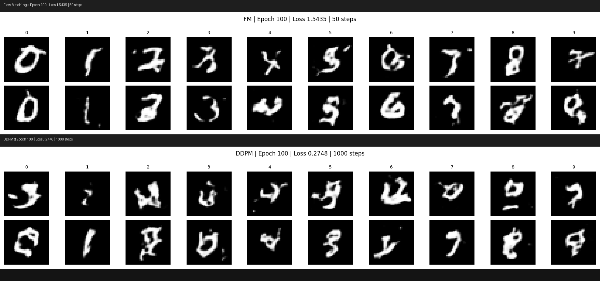
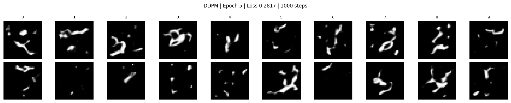
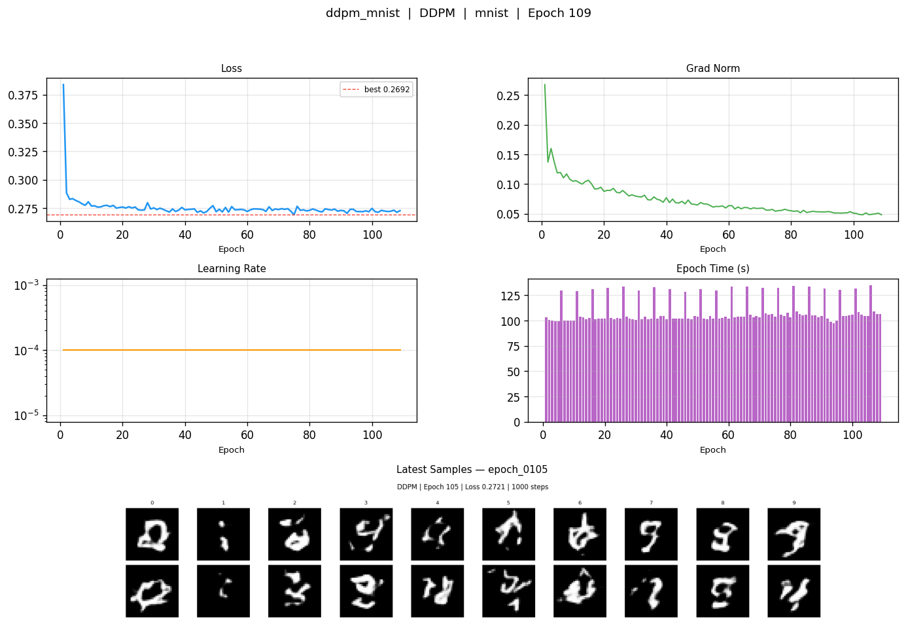
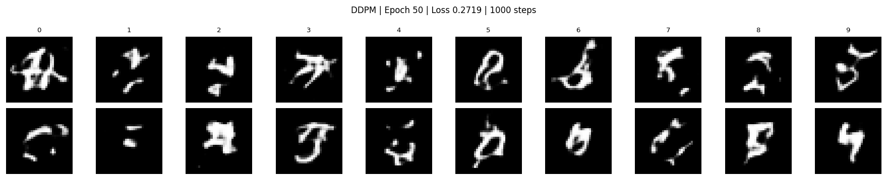
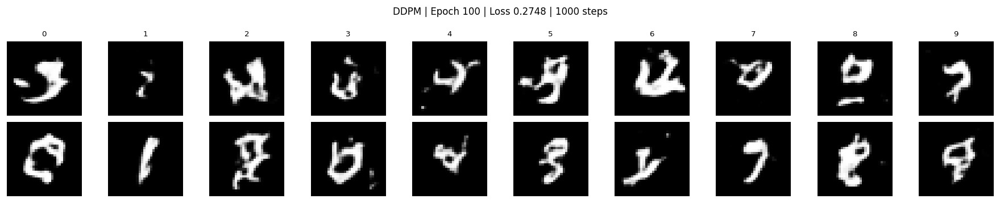
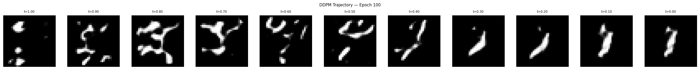

# acceleration-flow-matching

A latent diffusion framework comparing DDPM, DDIM, and Flow Matching on MNIST and CIFAR10, built on a shared ViT backbone and spatial VAE. Trained on Google Colab (T4/V100, 12GB VRAM).

---

## FM vs DDPM at Epoch 100



*Both trained for 100 epochs on the same architecture. FM uses 50 sampling steps, DDPM uses 1000. FM produces more consistent, readable digits.*

---

## Training Progress

| Flow Matching | DDPM |
|---|---|
|  |  |

*Each frame is a 5-epoch step over 100+ epochs.*

---

## Overview

This repo implements three generative modeling approaches on the same architecture:

- **DDPM** — 1000-step denoising diffusion probabilistic model
- **DDIM** — deterministic sampling from the DDPM noise schedule, 50 steps
- **Flow Matching** — straight-path ODE with Euler and Heun solvers, 20-50 steps

All three share the same `LatentViT` backbone (~5.5M params) and `SpatialVAE` encoder. The VAE compresses images to a 16-channel 8x8 latent space before any diffusion training.

---

## Architecture

### SpatialVAE

```
Input:   (B, 1, 32, 32)  [MNIST]  or  (B, 3, 32, 32)  [CIFAR10]
Encoder: Conv2d stack, 4x spatial downsampling
Latent:  (B, 16, 8, 8)  —  64 spatial patches, 16 channels each
Decoder: ConvTranspose2d stack, 4x upsampling
```

Measured latent statistics on MNIST: mean = 0.003, std = 0.998. Near-perfect N(0,1).

### LatentViT (shared backbone)

```
Input:       (B, 16, 8, 8) latent
PatchEmbed:  Conv2d(16, 192, kernel=1) -> rearrange -> (B, 64, 192)
pos_embed:   nn.Parameter(1, 64, 192), init normal(std=0.02)
time_embed:  Linear(1, 192) -> GELU -> Linear(192, 192)
class_embed: nn.Embedding(10, 192) -> Linear(192,192) -> GELU -> Linear(192,192)
Transformer: 12x TransformerEncoderLayer, norm_first=True, ffn_dim=768
output_proj: Linear(192, 16), init normal(std=0.02)
Output:      rearrange -> (B, 16, 8, 8)
```

Forward: `x = patch_embed(z)`, add `t_emb + c_emb`, then add `pos_embed`, then transformer.

| Parameter | Value |
|-----------|-------|
| embed_dim | 192 |
| depth | 12 |
| num_heads | 3 |
| head_dim | 64 |
| ffn_dim | 768 (4x embed) |
| Total params | ~5.5M |
| norm_first | **True** (required — see bugs) |

### Objectives

**DDPM / DDIM**
```
Noise schedule: linspace(1e-4, 0.02, 1000)
Target:         epsilon (predict added noise)
DDIM:           deterministic skip-step sampling
```

**Flow Matching**
```
Interpolant:  z_t = (1-t)*z_0 + t*z_1
Target:       v = z_1 - z_0
Sampling:     Euler  z_{t+dt} = z_t + v*dt
              Heun   corrected Euler, 2x passes/step
```

---

## Results

### Flow Matching — MNIST (100 epochs, LR=1e-4, batch=256)


| Epoch | Loss | Grad Norm | Notes |
|-------|------|-----------|-------|
| 1 | 1.776 | 0.248 | — |
| 2 | 1.579 | 0.215 | largest single-epoch drop |
| 10 | 1.560 | 0.177 | — |
| 50 | 1.545 | 0.104 | — |
| 98 | **1.542** | 0.099 | best checkpoint |
| 100 | 1.544 | 0.099 | — |

Avg epoch time: ~99s on T4. Loss drops sharply in the first 5 epochs then plateaus. Grad norm decays from 0.248 to a stable ~0.099.

| Epoch | Loss | Visual quality |
|-------|------|----------------|
| 5 | 1.5625 | Blurry blobs, no digit structure |
| 50 | 1.5446 | Connected strokes, class structure visible |
| 100 | 1.5435 | All 10 digits recognizable, consistent within class |


### DDPM — MNIST (109 epochs, LR=1e-4, batch=256)



| Epoch | Loss | Grad Norm | Notes |
|-------|------|-----------|-------|
| 1 | 0.384 | 0.268 | — |
| 5 | 0.282 | 0.119 | fast initial drop |
| 10 | 0.277 | 0.105 | — |
| 20 | 0.276 | 0.088 | — |
| 50 | 0.272 | 0.065 | — |
| 75 | **0.269** | 0.054 | best checkpoint |
| 100 | 0.275 | 0.051 | — |
| 109 | 0.273 | 0.048 | final |

Avg epoch time: ~109s on T4 (1000 sampling steps at eval is slower than FM's 50).

| Epoch | Loss | Visual quality |
|-------|------|----------------|
| 5 | 0.2817 | Disconnected fragments, sharp but incoherent |
| 50 | 0.2719 | Connected strokes, loosely digit-like |
| 100 | 0.2748 | Recognizable digits, blurrier and less consistent than FM |





> Note: DDPM and FM losses measure different things (noise prediction vs velocity prediction) and cannot be compared directly.

### Denoising Trajectories at Epoch 100

**Flow Matching** (t=0 noise → t=1 sample):


Structure solidifies around t=0.5. Digit is readable from t=0.6 onward. Smooth, straight path.

**DDPM** (t=1 noise → t=0 sample, reverse direction):



Structure emerges gradually in the middle timesteps. Noisier path compared to FM — expected, since DDPM traverses a stochastic SDE rather than a straight ODE.

### Sampling Speed

| Method | Steps | Quality |
|--------|-------|---------|
| DDPM | 1000 | Reference |
| DDIM | 50 | Slightly below DDPM |
| FM (Euler) | 50 | Comparable to DDIM-50, better visual than DDPM-1000 at epoch 100 |
| FM (Euler) | 20 | Slightly below FM-Euler-50 |
| FM (Heun) | 20 | Better than FM-Euler-50 |

---

## Key Bugs Fixed

**`norm_first=True` is required at depth 12.** Post-LN collapses feature std to ~0.008 after 12 layers. Output projection maps near-zeros to near-zeros. Loss flatlines at ~1.0 without moving. One flag change fixed it.

**`output_proj` needs explicit init.** `nn.init.normal_(weight, std=0.02)` alongside the norm fix is required for stable early training.

**Test from pure noise, not encoded images.** Passing a clean latent to DDPM produces corrupted output — that is correct behavior. DDPM is trained on noisy inputs. Correct test: `z = torch.randn(...)` then run the full reverse process.

**Class embedding scale mismatch.** Manual `std=0.02` init on class embedding vs Kaiming on time embedding gave a 12x scale gap. Removed the manual init and added an MLP projection layer.

---

## Installation

```bash
git clone https://github.com/shubham-sahoo/acceleration-flow-matching
cd acceleration-flow-matching
pip install -r requirements.txt
```

```
torch>=2.0.0
torchvision
einops
matplotlib
Pillow
numpy
tqdm
scipy
```

---

## Usage

```python
from src.models.vae import SpatialVAE
from src.models.vit import LatentViT
from src.diffusion.flow_matching import FlowMatching

vae   = SpatialVAE(in_channels=1).to(device)
model = LatentViT(embed_dim=192, depth=12, num_heads=3).to(device)
fm    = FlowMatching(model, vae, device=device)

# Training
loss = fm.training_step(images, class_labels)

# Sampling
z      = torch.randn(10, 16, 8, 8, device=device)
labels = torch.arange(10, device=device)
samples = fm.sample(z, labels, t_steps=50, method='euler')
```

---

## Repo Structure

```
acceleration-flow-matching/
├── src/
│   ├── models/       vae.py, vit.py
│   ├── diffusion/    ddpm.py, flow_matching.py
│   └── utils/        training_callbacks.py, visualization.py
├── notebooks/        01_vae_training, 02_ddpm_training, 03_flow_matching
├── assets/           GIFs, dashboards, sample images, comparison
├── experiments/      auto-created by training callback
└── requirements.txt
```

---

## Citation

```bibtex
@misc{sahoo2026accelfm,
  author = {Shubham Somnath Sahoo},
  title  = {acceleration-flow-matching},
  year   = {2026},
  url    = {https://github.com/shubham-sahoo/acceleration-flow-matching}
}
```

**Author:** Shubham Somnath Sahoo — IIT Kharagpur (EE+CS) | ML Research Engineer
